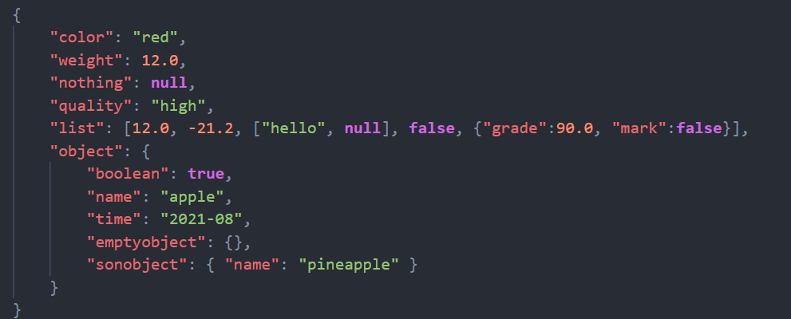
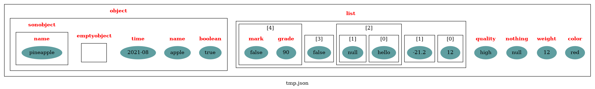

# easy-json
parse json to c++ class or vice versa.  
use dot language to visualize the js object.
```shell
cd build && make
./main tmp.json
dot -Tpng tmp.dot -o tmp.png
```  
TODO:
1. string encode
2. double string convert
3. ...  

事实上用dot language来做可视化并不是很好，用它的原因主要是比较简单、规则，容易自动去生成（之前也在html之间纠结了一下用哪个）。不过最终实现后还是会出现各种各样的问题。主要的麻烦点在于dot很难去刻画这种嵌入式的结构，我只能强行用子图这个特性来做，但是在dot中子图并不是很灵活，不能像结点一样去操作，另外是在渲染的时候，如果外层套了子图，它的顺序会和代码反过来，所以在最终的图形中是从右往左显示的，这个问题想了很久也没办法解决，只能强行加了一个索引的标志。

+ json_file

+ graphviz picture


